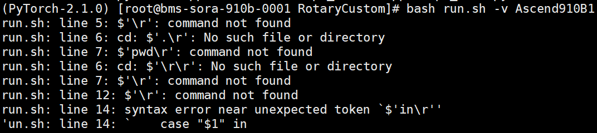

## 目录结构介绍
```
├── Rope_Custom
│   ├── figure               // README文件中的图片
│   ├── test_rope1d.py       // python调用测试rope1d脚本
│   ├── test_rope3d.py       // python调用测试rope3d脚本
│   ├── rope_custom.cpp      // 算子实现
│   ├── CMakeLists.txt       // 编译工程文件
│   ├── pybind11.cpp         // pybind11函数封装
│   └── run.sh               // 编译运行算子的脚本
```
## 算子基础信息
|  算子名称    |  Rope_Custom|
|-------------|-------------|
|   api接口   |    rope_custom(x,cos,sin,tileLength)   |
|    支持数据类型   |    float16,float32,bfloat16  |
|    支持芯片类型  |    910B  |

## 算子限制

### ①输入维度限制
目前限制x、cos、sin的最后一个维度为32,64,96,128。<br />
(如需更大的维度需求可以考虑torch_npu的算子torch_npu.npu_rotary_mul)

### ②输入的总数限制
由于算子tileLen和AI_Core的数量限制，输入的总元素数量目前限制在48\*1024\*6的整数倍


## 代码实现介绍
- kernel实现  
  Add算子的数学表达式为：
  ```
  x1, x2 = x.chunk( 2, dim= -1)
  y = cat( [-x2, x1], dim= -1)
  z = x* cos + y* sin
  ```
  计算逻辑是：Ascend C提供的矢量计算接口的操作元素都为LocalTensor，输入数据需要先搬运进片上存储，然后使用计算接口完成所有的乘法和加法操作，得到最终结果，再搬出到外部存储上。

  Rope算子的实现流程分为3个基本任务：CopyIn，Compute，CopyOut。
  
  Ⅰ、CopyIn任务负责将Global Memory上的输入Tensor，xGm、cosGm和sinGm搬运到Local Memory，分别存储在xLocal、cosLocal，sinLocal上，对于y，CopyIn通过DataCopy函数对xGm的数据按最后一个维度进行chunk和cat操作得到y，并存储在yLocal上。

  Ⅱ、Compute任务负责①对yLocal的最后一维度的前半部分乘以-1②对xLocal、yLocal、cosLocal和sinLocal执行乘法和加法操作操作，计算结果存储在zLocal中。
  
  Ⅲ、CopyOut任务负责将输出数据从zLocal搬运至Global Memory上的输出Tensor zGm中。具体请参考[rope_custom.cpp](./rope_custom.cpp)。

- 调用实现  
  通过PyTorch框架进行模型的训练、推理时，会调用到很多算子进行计算，调用方式也和kernel编译流程相关。对于自定义算子工程，需要使用PyTorch Ascend Adapter中的OP-Plugin算子插件对功能进行扩展，让torch可以直接调用自定义算子包中的算子；对于KernelLaunch开放式算子编程的方式，也可以使用pytorch调用，此样例演示的就是这种算子调用方式。

  pybind11.cpp文件是一个C++的代码示例，使用了pybind11库来将C++代码封装成Python模块。该代码实现中定义了一个名为m的pybind11模块，其中包含一个名为run_rope_custom的函数。该函数与my_rope::run_rope_custom函数相同，用于将C++函数转成Python函数。在函数实现中，通过c10_npu::getCurrentNPUStream() 的函数获取当前NPU上的流，并调用ACLRT_LAUNCH_KERNEL宏启动自定义的Kernel函数rope_custom，在NPU上执行算子。

  在test_rope1d.py调用脚本中，通过导入自定义模块rope_custom，调用自定义模块rope_custom中的rope1函数，在NPU上执行RoPE1D的计算操作，并将结果保存在变量z中。
## 运行样例算子
  - 安装pytorch (这里使用2.1.0版本为例)

    **aarch64:**

    ```bash
    pip3 install torch==2.1.0
    ```

  - 安装torch-npu （以Pytorch2.1.0、python3.9、CANN版本8.0.RC1.alpha002为例）

    ```bash
    git clone https://gitee.com/ascend/pytorch.git -b v6.0.rc1.alpha002-pytorch2.1.0
    cd pytorch/
    bash ci/build.sh --python=3.9
    pip3 install dist/*.whl
    ```

    安装pybind11
    ```bash
    pip3 install pybind11
    ```

  - 打开样例目录

    ```bash
    cd ${git_clone_path}/RotaryCustom
    ```

  - 修改配置
    * 修改CMakeLists.txt内SOC_VERSION为所需产品型号。
    * 修改CMakeLists.txt内ASCEND_CANN_PACKAGE_PATH为CANN包的安装路径。
    * 修改CMakeLists.txt内RUN_MODE为所需编译模式。

    RUN_MODE：编译方式，当前仅支持NPU上板。支持参数为[npu]，默认值为npu。

    SOC_VERSION：昇腾AI处理器型号，如果无法确定具体的[SOC_VERSION]，则在安装昇腾AI处理器的服务器执行npu-smi info命令进行查询，在查询到的“Name”前增加Ascend信息，例如“Name”对应取值为xxxyy，实际配置的[SOC_VERSION]值为Ascendxxxyy。

  - 样例执行

    ```bash
    rm -rf build
    mkdir build
    cd build
    cmake ..
    make
    python3 ../test_rope.py
    ```

    用户亦可参考run.sh脚本进行编译与运行。
    ```bash
    bash run.sh -v Ascend910B1
    ```

  - 其他py文件调用

    在目标python文件中的头部加入引入编译后产生的文件夹build路径，便可以正常import rope_custom自定义rope算子，然后正常调用即可
    ```python
    import os,sys
    current_dir = os.path.dirname(os.path.abspath(__file__))
    build_path = os.path.join(current_dir, 'build')
    sys.path.append(build_path)
    import rope_custom
    ```


# 常见问题

## 编译相关问题
### ①c++编译报错
在c++中如下模板类中，已经通过if进行分支判断T和K相同的情况和不同的情况，但是仍然报错
```c++
template<class T, class K>
class KernelRope {...}
```
原因：
可能的原因是编译器在编译模板时，仍然会实例化所有代码，而不仅仅是条件判断语句中的分支。这是因为 C++ 模板在编译时会实例化所有可能的模板代码，而不会推迟到运行时。因此，即使某个分支没有被实际使用，编译器也会尝试编译它，这会导致类型不匹配或其他错误。

解决方法：
```c++
if constexpr (std::is_same<T, K>::value)
  ...
else
  ...
```

## 内存管理相关问题
### ①算子内存数量限制
在算子侧由于Pipe对TQue进行InitBuffer申请同一类型内存有数量限制，超过数量限制会导致算子计算结果出现错误。

针对Atlas训练系列产品不超过4块<br />
针对Atlas推理系列产品(Ascend 310P处理器)AI Core不超过8块<br />
针对Atlas A2训练系列产品/Atlas 800l A2推理产品不超过8块<br />
如下的InitBuffer情况一共申请了3*2=6块内存
```c++
TPipe pipe;
TQue<QuePosition::VECIN, 3> inQueueX;
pipe.InitBuffer(inQueueX, 2, this->bufferLength * sizeof(T));
```

## 算子调用API相关问题  
### ①mask参数相关
mask用于控制每次迭代内参与计算的元素。参与计算的元素数量取决于数据类型的大小，每次迭代可以计算256bit元素，因此float16数据每次参与迭代128个元素，float32数据每次参与迭代64个元素。

根据mask的数据类型可以分为两种模式<br />
- 模式1 连续模式 --uint64：<br />
表示前面连续的多少个元素参与计算。
- 模式2 逐bit模式--uint64[2] （长度为2的uint64数组）：<br />
可以按位控制哪些元素参与计算，bit位的值为1表示参与计算，0表示不参与。<br />
例如：mask=[8, 0]，8=0b1000，表示仅第4个元素参与计算。<br />
注意：当计算的数据类型为32bit那么mask[1]=0
### ②block stide和repeat stride参数

详细说明见[基础API通用说明](https://www.hiascend.com/document/detail/zh/canncommercial/80RC22/apiref/opdevgapi/atlasascendc_api_07_0011.html#ZH-CN_TOPIC_0000001949462686__section2815124173416)

## 其他问题
### ①脚本问题

Linux下执行Shell脚本出现$‘\r‘: command not found解决方法

原因：
是Windows和Linux的.sh脚本文件格式不同，如果在脚本中有空行，脚本是在Windows下进行编辑之后上传到linux上去执行的话，就会出现这个问题。windows 下的换行符是\r\n，而 linux 下的换行符是\n，没有识别/r,所以会导致上述的报错，这个属于脚本编码的问题。

解决方法：
```bash
sed -i 's/\r//' run.sh
```
